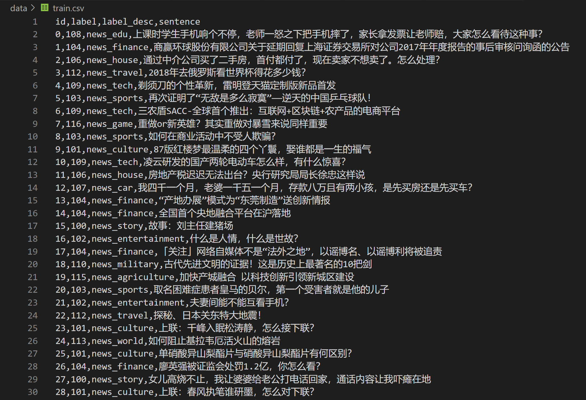
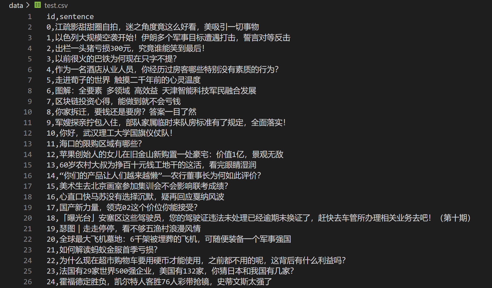

# text-classification-toutiao

Toutiao (literally "Headlines") is a Chinese news and information content platform, a core product of the China-based company ByteDance. Everyday, thousands of news content are created and read by Toutiao's 279 million monthy active users. The content pushed to each user is different, based on the past content read and searched by each user. Classifying news content to the right topic and tailor-make content for each user is crucial for the success of the business model of Toutiao. 
 
The dataset used in this project is a microcosm of massive amount of news content created on Toutiao everyday. The training data consisted of 533612 labeled news items, while the test set consisted of 10000 unlabeled news items. The structure of the data can be found below.
 

### train.csv

 

The training data consisted of four columns. id is the unique identifier of each news item; label tells us the news_type of the new item; The desciption of label can be found in label_desc column; sentence is the title of the news item.

 

 

### test.csv

 

As mentioned before, test data consisted of only two columns, id and sentence.

 

 

This project aims to train several deep learning models to perform the text classification task. Since only training set provides actuall labels, the model is trained on a subset of the training data and evaluated on the validation set, a smaller subset of the training data. The models used are TextCNN, Bert for Sequence Classification, Bert + CNN head (1d conv + adaptive max pool), Nezha (Neural Contextualized Representation for Chinese Language Understanding). 

 

A key part of the success of the task is to find a good word embedding (vector representation) for the words, and thus sentences, in the news items. For TextCNN, which does not have an embedding layer in itself, we used an embedding trained on large Weibo Corpus (can be found under model_config/textcnn_config/sgns.weibo.word.bz2). For Bert and NeZha models, we loaded configurations that are also trained on large corpus of Chinese text data.

 

The training was done on Google Colab. Model training of each model can be executed using codes in the train.ipynb file.

 

## Reference:

TextCNN: https://arxiv.org/abs/1408.5882
 
Nezha: https://arxiv.org/abs/1909.00204
 
Bert: https://arxiv.org/abs/1810.04805
 
Attention is All You Need: https://arxiv.org/abs/1706.03762